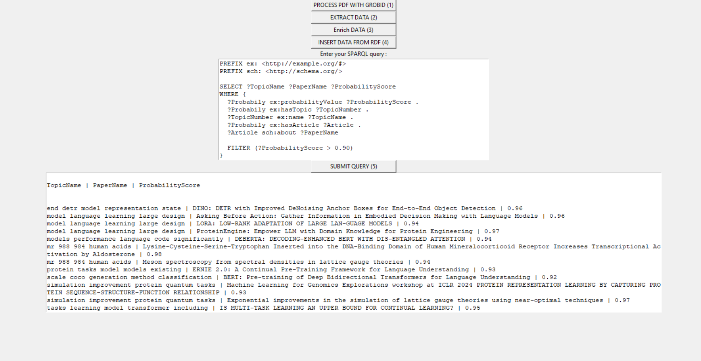
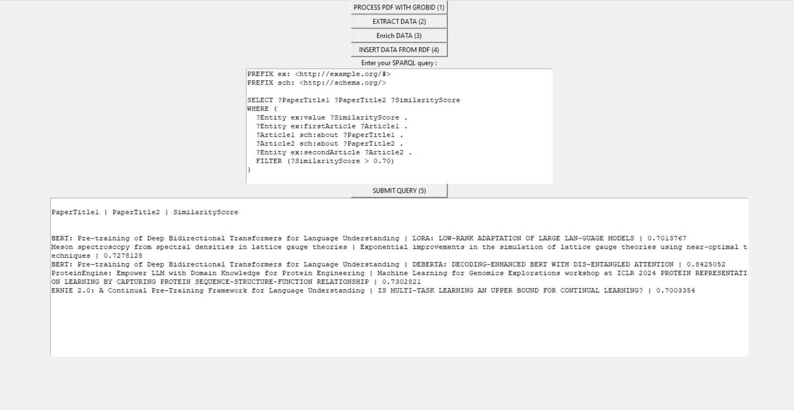
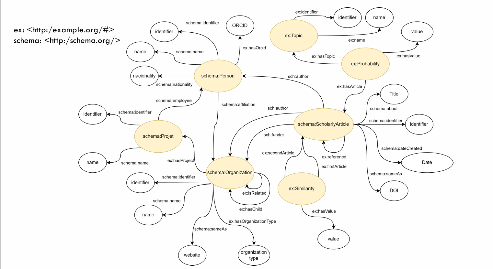

# Advanced Paper Analyzer

[](https://doi.org/10.5281/zenodo.11243971)
[](https://advanced-paper-analyzer.readthedocs.io/en/latest/?badge=latest)

## Table of Contents
- [Advanced Paper Analyzer](#advanced-paper-analyzer)
  - [Table of Contents](#table-of-contents)
  - [Introduction](#introduction)
    - [Installation](#Installation)
  - [How to use](#how-to-use)

## Introduction
Advanced Paper Analyzer takes a set of research papers and extracts its metadata to obtain information. It accesses Wikidata and ROR to expand the information and also has processes that compare the similarity between the abstracts taken from the papers and that analyze the possible topics the paper is about.

### Installation

1. Clone the repository:

```bash
git clone https://gitlab.utc.fr/royhucheradorni/ia04.git
```

2. Python

The code runs on **Python 3.10**, so it must be installed in the system to be able to use Advanced Paper Analyzer.


3. Dependencies

Dependencies can be installed by using [Poetry](https://python-poetry.org/). You simply must go to the root directory of the repository and run:

```bash
poetry install
```

Or install all dependencies with pip using requirements.txt in the root directory of the repository by running:

```bash
pip install -r requirements.txt
```

4. Grobid

Grobid is used to extract metadata from the papers, which are then used for further analysis. For this reason you must install either the full or light version of the [Grobid 0.8.0](https://grobid.readthedocs.io/en/latest/) [Docker](https://www.docker.com/) image. 
To run Grobid use one of this commands depending on version you have:

Full image:
[https://hub.docker.com/r/grobid/grobid](https://hub.docker.com/r/grobid/grobid)
```bash
docker pull grobid/grobid
```

Light image:
[https://hub.docker.com/r/lfoppiano/grobid/](https://hub.docker.com/r/lfoppiano/grobid/)
```bash
docker pull lfoppiano/grobid
```

5. Apache Jena Fuseki

[Jena Fuseki](https://jena.apache.org/documentation/fuseki2/) is used to create the triple-store and the SPARQL endpoint, so it must be installed and run as described in the section to create the dataset
```bash
docker pull stain/jena-fuseki
```
## How to use


1. run Jena-fuseki and grobid with : 
```bash
docker run -p 8070:8070 lfoppiano/grobid:latest-develop
```
```bash
docker run -p 3035:3030 -e ADMIN_PASSWORD=pw123 -e FUSEKI_DATASET_1=KG_dataset stain/jena-fuseki
```
it creates the dataset at the same time

2. Run the script interface.py with the parameter 0
```bash
poetry run python interface.py 0
```

You can now : 
- PROCESS PDF WITH GROBID  : process all the pdf in the directory Corpus_pdf to reformat the data/metadata in a XML format.

- EXTRACT DATA : Extract the data (title, date, author) from the processed pdf and do some topic modeling and compute similarity between the abstract of each pdf.

- Enrich DATA : Add more information coming from ROR and WIKIDATA (name, authors, organizations_founder of referenced papers).

- INSERT DATA FROM RDF : Add all this data to KG server Jena-fuseki.

- SUBMIT QUERY : in the input box, write your SPARQL queries and submit. 

Example of queries :
1. select each topic of which the papers have more than 0.90 probability of belonging to that topic :


2. to request all the pair of article with more than 70% of similarity :



Our RDF diagram :


    
### Coming soon 

- Docker containerization (still problem to display GUI)
